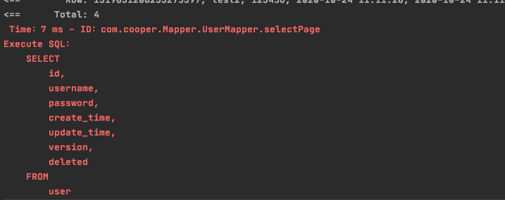

### 锁
#### 乐观锁
总认为不会出现问题。无论做什么事情都不会去加锁

##### 原理
通过比较version实现
- 取出记录时，获取当前version
- 更新时，带上这个version
- 执行更新时， set version = newVersion where version = oldVersion
- 如果version不对，就更新失败

##### 过程
1. 在数据库中添加version字段（int类型，默认值为1）
2. 在实体类中对应的version中添加注解@Version
3. 对乐观锁进行配置
     ``` java
     //开启乐观锁配置
        @Bean
        OptimisticLockerInterceptor optimisticLockerInterceptor(){
            return new OptimisticLockerInterceptor();
        } 
    ```
4. 测试（见test代码）

#### 悲观锁
总认为不会出现问题。无论做什么事情都会去加锁

### 分页
1. 添加分页配置
    ``` java
      //开启分页配置
        @Bean
        PaginationInterceptor paginationInterceptor(){
            return new PaginationInterceptor();
        }
    ```
2. 分页测试（代码见测试类）

### 逻辑删除
1. 添加逻辑删除配置
    ``` java
     //开启逻辑删除
        @Bean
        ISqlInjector iSqlInjector(){
            return new LogicSqlInjector();
        }
    ```
2. 配置yaml文件
    ```yaml
    mybatis-plus:
      configuration:
        log-impl: org.apache.ibatis.logging.stdout.StdOutImpl
      global-config:
        db-config:
          logic-delete-value: 1 #逻辑删除
          logic-not-delete-value: 0 #逻辑未删除
    ```
3. 在数据库中添加对应的字段（delete int类型 默认值为0 表示逻辑未删除）
4. 在实体类中添加逻辑删除 @TableLogic

### SQL执行效率检测插件
1. 添加执行效率插件配置
    ``` java
    //SQL执行效率插件
    @Bean
    @Profile({"dev","test"})
    PerformanceInterceptor performanceInterceptor(){
        //设置了最大耗时时间为100ms（超过该时间的SQL语句将放弃返回最终的结果）,SQL语句输出格式化
        return new PerformanceInterceptor().setMaxTime(100).setFormat(true);
    }
    ```
2. 在yaml中设置环境为dev或者test
3. 测试（直接执行test中的语句便可以得到执行效率的分析）
    
    

### 条件查询器
见测试类

### 自动填充(代码实现)
1. 在SQL中添加对应的字段
2. 编写MetaObjectHandler的实现类
    ``` java
    /**
     * 填充处理器
     */
    @Component
    public class mybatisMetaHandler implements MetaObjectHandler {
        @Override
        public void insertFill(MetaObject metaObject) {
            this.setFieldValByName("createTime",new Date(),metaObject);
            this.setFieldValByName("updateTime",new Date(),metaObject);
            this.setFieldValByName("gmtCreate",new Date(),metaObject);
            this.setFieldValByName("gmtUpdate",new Date(),metaObject);
        }
    
        @Override
        public void updateFill(MetaObject metaObject) {
            this.setFieldValByName("updateTime",new Date(),metaObject);
            this.setFieldValByName("gmtUpdate",new Date(),metaObject);
        }
    }
    ```
3. 在实体类的字段中添加对应的注解 @TableField(fill = FieldFill.XXXX)

### 自动生成代码
1. 添加依赖
    ```xml
    <dependency>
        <groupId>org.apache.velocity</groupId>
        <artifactId>velocity-engine-core</artifactId>
        <version>2.0</version>
    </dependency>
    ```
2. 编写代码
    ``` java
    package com.cooper;
    
    import com.baomidou.mybatisplus.annotation.FieldFill;
    import com.baomidou.mybatisplus.annotation.IdType;
    import com.baomidou.mybatisplus.generator.AutoGenerator;
    import com.baomidou.mybatisplus.generator.config.*;
    import com.baomidou.mybatisplus.generator.config.po.TableFill;
    import com.baomidou.mybatisplus.generator.config.rules.DateType;
    import com.baomidou.mybatisplus.generator.config.rules.NamingStrategy;
    
    import java.util.ArrayList;
    import java.util.List;
    
    public class AutoGenerateCode {
    
        public static void main(String[] args) {
            // 代码生成器
            AutoGenerator mpg = new AutoGenerator();
    
            // 全局配置
            GlobalConfig gc = new GlobalConfig();
            String projectPath = System.getProperty("user.dir");//获取当前项目路径
            gc.setOutputDir(projectPath + "/src/main/java");
            gc.setAuthor("Cooper");
            gc.setOpen(false);//是否打开资源管理器
            gc.setFileOverride(true);//是否覆盖原来生成的
            gc.setSwagger2(true); //实体属性 Swagger2 注解
            gc.setServiceName("%sService");//去除service的I前缀
    
            //设置实体类的代码
            gc.setDateType(DateType.ONLY_DATE);//设置日期类型
            gc.setIdType(IdType.ID_WORKER);//默认是初始的id生成算法，不变
            gc.setSwagger2(true);//配置swagger2
    
            mpg.setGlobalConfig(gc);
    
    
            // 数据源配置
            DataSourceConfig dsc = new DataSourceConfig();
            dsc.setUrl("jdbc:mysql://localhost:3306/test?useUnicode=true&useSSL=false&characterEncoding=utf8");
            // dsc.setSchemaName("public");
            dsc.setDriverName("com.mysql.cj.jdbc.Driver");
            dsc.setUsername("root");
            dsc.setPassword("12345678");
            mpg.setDataSource(dsc);
    
            // 包配置
            PackageConfig pc = new PackageConfig();
    
            //设置模块路径为com.cooper.learn
            pc.setModuleName("learn");//设置模块名称
            pc.setParent("com.cooper");
            pc.setEntity("entity");//实体类文件夹名称
            pc.setMapper("mapper");
            pc.setController("controller");
            pc.setService("service");
            mpg.setPackageInfo(pc);
    
    
            // 策略配置
            StrategyConfig strategy = new StrategyConfig();
            strategy.setInclude("person");//设置需要映射的表名
            strategy.setNaming(NamingStrategy.underline_to_camel);
            strategy.setColumnNaming(NamingStrategy.underline_to_camel);
            strategy.setEntityLombokModel(true);
            strategy.setLogicDeleteFieldName("deleted");//逻辑删除
    
            //自动填充配置
            TableFill gmtCreate = new TableFill("gmt_create", FieldFill.INSERT);
            TableFill gmtUpdate = new TableFill("gmt_update", FieldFill.INSERT_UPDATE);
            List<TableFill> list = new ArrayList();
            list.add(gmtCreate);
            list.add(gmtUpdate);
            strategy.setTableFillList(list);
    
            //设置乐观锁
            strategy.setVersionFieldName("version");
    
            strategy.setRestControllerStyle(true);//使用Restful风格
            strategy.setControllerMappingHyphenStyle(true);
            mpg.setStrategy(strategy);
    
            mpg.execute();
        }
    }

    ```
3. 运行代码